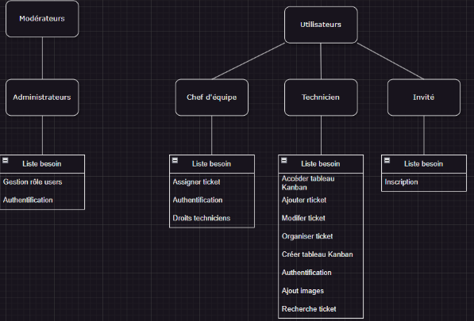
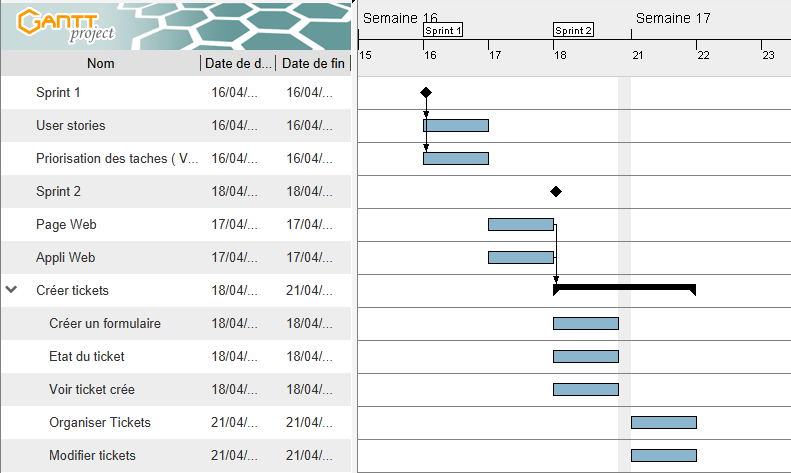

# TP Ticket

> conception d'une Mini plateforme Trello ( Césarien ) Application WEB

https://docs.google.com/document/d/13zBZlwhX-ck_OT52vFy9yyKO2N4VTYM5i4MC9jQj0vw/edit?pli=1&tab=t.0

## Development

### Languages & Framework

- NextJs
- MySQL

## Equipe

### Scrum Master
 - Benjamin
### Product Owner
 - ?
### Front Master
 - Guillaume
### Back Master
 - Mattéo
### Dev
 - Mathieu
 - Florian

## Versioning

>Appli web capable de créer, modifier, suivre et organiser tickets dans Kanban 

| Version | Fonctionnalité développées |
| :---------------: |:---------------|
| V1 | - Page + Appli Web fonctionnelle |
| * | - Créer tickets | 
| * | - Créer un formulaire | 
| * | - Etat de la tâche | 
| * | - Voir tickets |
| * | - Organiser dans différentes catégories |
| * | - Modifier tickets |
| V1.1 |  - Onglet Kanban avec différents tableaux|
| V1.2 |  - Authentification Inscription Connexion
| * | - Back-end BDD |
| * |	- Gestion users |
| * |	- Gestion ticket (image, archive…) | 
| * | - Créer tickets |
| * | - Assignation des tickets |
| V1.3 | - Ajout de rôles et permissions associées |
| * | - Barre de recherche/Filtres |
| V1.4 | - Le CSS
| * | - Ajout d’images

## User Story

| En tant que  | je voudrais | afin de |
|:--|:--|:--|
| Invité | pouvoir me créer un compte | créer un compte |
| Technicien | pouvoir ajouter des tickets à mon tableau | pouvoir accéder à mes tickets |
| Technicien | pouvoir ajouter des tickets à mon tableau | pouvoir tracer les interventions  |
| Technicien | pouvoir modifier mes tickets | rectifier et décrire l’avancée d’un ticket |
| Technicien | pouvoir organiser mes tickets | d’être organisé  |
| Technicien | pouvoir créer plusieurs tableaux Kanban | séparer les différents projets |
| Technicien | pouvoir m’authentifier |  d’accéder à l’application |
| Technicien | pouvoir ajouter des images à un ticket | ajouter des détails à mon ticket |
| Technicien | pouvoir rechercher mes tickets | retrouver mes anciens tickets  |
| Chef d’équipe | pouvoir assigner des tickets  | mieux gérer la résolution de ticket |
| Chef d’équipe| pouvoir m’authentifier | accéder à l’application |
| Chef d’équipe | pouvoir faire tout ce qu’un technicien peut faire | accès aux mêmes fonctionnalités |
| Administrateur | pouvoir gérer les rôles des utilisateurs | attribuer la bon rôle au bon utilisateur |
| Administrateur | je veux pouvoir m’authentifier | accéder à l’application |

## Organigramme des besoins

## GANT

